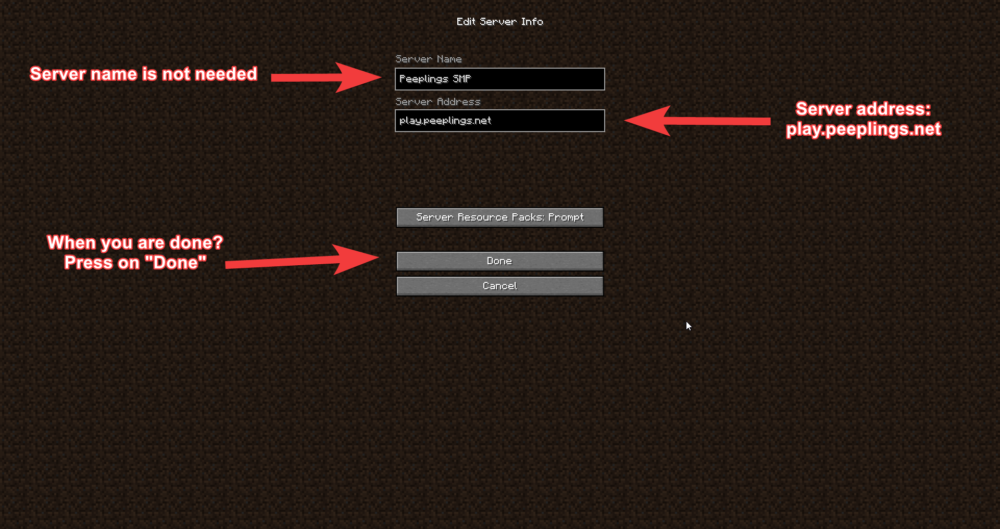
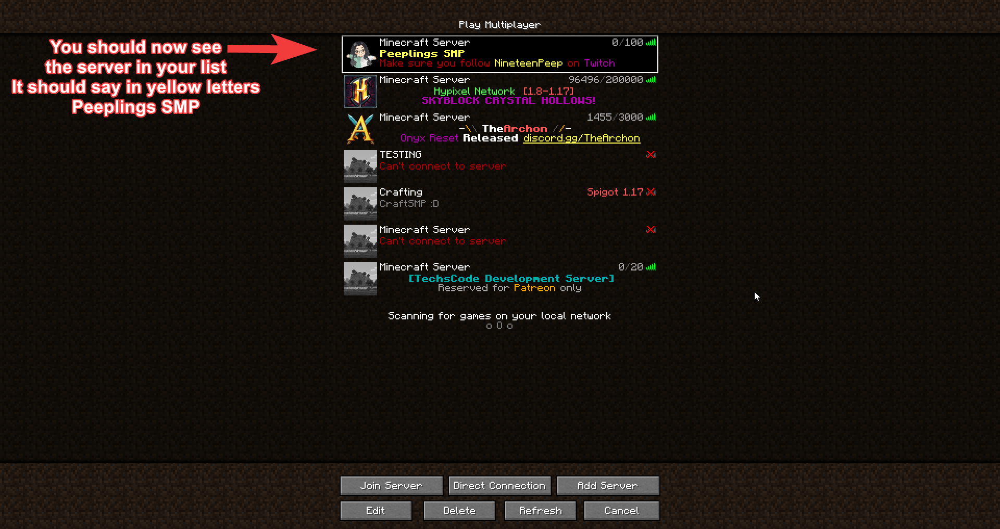

# Java Edition

## How can I join the Peeplings SMP?

First of all you need Premium Minecraft account, without a premium Minecraft account **YOU CAN'T JOIN!**\
****You also need to make sure you are on the latest version of Minecraft, by writing this tutorial it is 1.17.1.

If you have pressed on "Play" the big green button then it should give you after it started up a menu with "Singleplayer" "Multiplayer" "Minecraft Realms" and "Options" "Quit game".\
You need to press on **Multiplayer**

If it's your first time playing Multiplayer or first time on 1.17.1 Multiplayer then you need to first accept a message that Microsoft don't take any responsibility about the damage that can be done in Online multiplayer games. So it's your own risk. But simply you can accept the message and go on.

You now need to press on "Add server" down below around the right corner in your screen.

Now you are in the Add server screen and the server name is optional so you don't need to fill it in. If you want categorize your servers then you can fill it in with "**Peeplings SMP**".\
For the server address you need to fill in for sure and that is with our server address named **play.peeplings.net** No port needed. And when you are done you can press on "Done".

Now you should see our server Peeplings SMP in your server list. It looks like as in the image but not really on the same spot. Now you can play the server. :D

